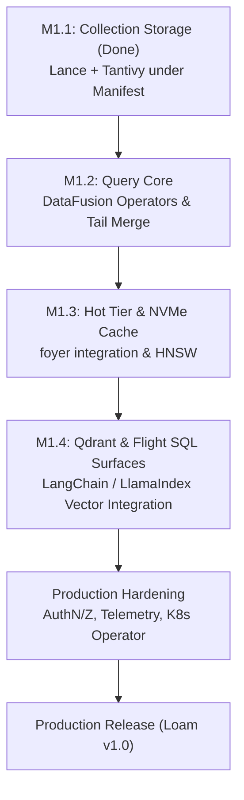

# Operon (Loam) — Architecture Review, Readiness Assessment & Strategic Recommendations

**Document Status:** Final · **Adopted 2026-09-25** as decisions D42–D50 ([decision log](./design/13-decision-log.md)); the resulting roadmap is [§12](./design/12-roadmap-testing-risks.md)  
**Date:** September 2026  
**Target Codebase:** [`Operon (v0.0.1)`](..)  
**Evaluated Milestone:** M1.1 (Collection Storage)  

---

## 1. Executive Summary & Production Readiness Verdict

> ### ⛔ Production Readiness Verdict: NOT Ready for Production
> Operon is in active foundational development (**v0.0.1 / Milestone M1.1**). While its storage, log, and consensus primitives are engineered to an exceptionally high standard, it lacks customer-facing query engines, distributed clustering, authentication, and operational telemetry. It should not be deployed in production environments at this stage.

### Key Blockers for Production Deployment
1. **Query Engine & Interfaces are Unimplemented:** While data can be appended to internal log streams and materialized into Lance/Tantivy formats, [`operon-query`](./plans/2026-09-24-m1.2-query-engine.md) (DataFusion physical execution operators, hybrid fusion, tail merges) and all external client compatibility gateways (Qdrant, Elasticsearch, Kafka, Arrow Flight SQL) do not yet exist.
2. **Single-Node Local Topology Only:** The binary currently runs exclusively in `dev` or `standalone` mode with a single-node embedded Raft metastore (`NODE_ID = 1`). Distributed network RPC, node registries, and rendezvous partition routing are scheduled for future milestones.
3. **No AuthN, AuthZ, or Multi-Tenant Guardrails:** There are currently no authentication mechanisms (TLS, API tokens, mTLS, SASL), authorization frameworks (RBAC / OpenFGA), or tenant quota governors.
4. **Hot Tier Under Active Construction:** The NVMe-cached HNSW vector index (`operon-hnsw`), split pinning, and real-time in-memory tail indexes are scheduled for milestones M1.2 and M1.3.
5. **No Production Observability & Lifecycle Tooling:** Lacks Prometheus/OpenTelemetry instrumentation, live diagnostic dumps, zero-downtime rolling upgrade automation, and a Kubernetes operator.

---

## 2. Architectural Analysis: Current State & Quality

### 2.1 Core Architectural Principles
* **Object Storage as the Sole Source of Truth:** Compute is completely stateless. Long-term durable data resides in open formats on S3/GCS/Azure/MinIO, eliminating expensive 3× block-storage replication.
* **The Log is the Spine:** All writes append to an internal partitioned log stream first. Collections, analytical tables, and graphs are downstream materializations maintained by declarative **Links** ([`operon-link`](../crates/operon-link)).
* **Causal Consistency via Tokens:** Writes return lightweight consistency tokens `{(stream, partition, offset)...}` that provide read-your-own-writes (RYOW) guarantees across different query surfaces.
* **Open Formats at Rest:** Apache Iceberg (analytics), Lance (vector + columnar documents), Tantivy split bundles (full-text indices), and CSR/CSC sidecars (graph adjacency). Data can be queried by external engines (DuckDB, Trino, Spark) without lock-in.

### 2.2 Engineering High-Water Marks
The foundation code built in M0 and M1.1 demonstrates world-class systems programming discipline:
* **Deterministic Simulation Testing (DST):** [`operon-sim`](../crates/operon-sim) executes seeded in-process cluster simulations testing Raft consensus, worker crashes, network partitions (`Router`), and storage faults, verified with an integrated Wing–Gong–Lowe linearizability checker.
* **kill -9 Crash Consistency Verification:** [`crates/operon/tests/crash.rs`](../crates/operon/tests/crash.rs) instruments explicit failpoints across all critical paths (`wal.after_put`, `seg.after_swap`, `link.after_manifest_put`, `gc.after_delete`), verifying zero data loss and invariant preservation across hard aborts.
* **336-Cell S3 Fault Matrix:** [`crates/operon/tests/fault_matrix.rs`](../crates/operon/tests/fault_matrix.rs) validates resilience against S3 errors, 409/412 preconditions, timeouts, and network latency across all store operations.
* **Strict Rust Safety:** `#![forbid(unsafe_code)]` enforced workspace-wide, with strict Clippy checks and cargo-deny audits.

---

## 3. Protocol & Scope Strategy: "Should I Drop the Other Protocols?"

> ### Recommendation: YES. Narrow the protocol footprint immediately.
> Emulating Kafka, Elasticsearch, Qdrant, Neo4j Bolt, and ClickHouse simultaneously creates an unsustainable "five-product" trap.

### The Protocol Triage Matrix

| Surface / Protocol | Status in Roadmap | Strategic Recommendation | Rationale |
|---|---|---|---|
| **Arrow Flight SQL & Native REST** | M1.2 | **KEEP & EXPAND (Core)** | High-throughput, zero-copy, native Arrow/DataFusion protocol. Cleanest integration for Python, Go, Java, and C++. |
| **Qdrant REST & gRPC** | M1.4 | **KEEP (Core AI Surface)** | Modern, strictly typed, and the de facto standard for AI vector stores (LangChain, LlamaIndex, Haystack). High adoption value with moderate implementation complexity. |
| **Elasticsearch REST (Subset)** | M1.5 | **KEEP (Targeted Subset Only)** | Restrict scope to standard BM25 search and vector-store fixtures. Do not attempt full ES DSL parity. |
| **Kafka Wire Protocol** | M3 | **DROP / DEFER** | Rebuilding a Kafka broker (KIP-848, consumer group rebalancing, heartbeat loops, transactions) is a venture-scale project in itself. Expose native streaming HTTP/gRPC ingest endpoints instead. |
| **Neo4j Bolt / Cypher** | M2 | **DROP / DEFER** | Cypher parsing and recursive graph execution have a fraction of the market demand of vector/search. Handle graph relations via SQL joins or simple graph expansions in DataFusion. |
| **ClickHouse HTTP** | M4 | **DROP** | Operon's data is already open Apache Iceberg. Users can query Iceberg tables directly via DuckDB, Trino, or ClickHouse itself. Building a custom ClickHouse server inside Operon is redundant. |

---

## 4. Lakehouse Caching & Graph Architecture: Lessons from StarRocks & Nebula Graph

### 4.1 StarRocks Data Cache: Validation of Operon's Hot Tier
StarRocks proved to the data industry that analytical queries do not require stateful, dedicated storage clusters. By placing **stateless compute over Apache Iceberg on S3** and using a **two-tier (RAM + local NVMe) Data Cache**, StarRocks delivers memory-speed queries at object-storage economics.

Operon's hot-tier design ([docs/design/04-hot-tier.md](./design/04-hot-tier.md)) adopts this exact pattern via [`operon-cache`](../crates/operon-cache) (using RisingWave's `foyer` hybrid cache):
* **H0 Metadata (RAM):** Manifests, split footers, Parquet page indices.
* **H1 Block Cache (RAM → NVMe):** Transparent block-level caching of remote S3 ranges.
* **T1 / T2 Hot Projections (NVMe):** Derived local columnar projections for sub-second analytical latencies.

**Operon extends the StarRocks concept to multi-modal data:** applying the hybrid RAM+NVMe cache uniformly across tabular Iceberg files, Lance vector pages, and Tantivy inverted split files.

### 4.2 Nebula Graph vs. The GraphRAG Sweet Spot
Nebula Graph is an impressive distributed graph database, but running it in production requires managing three stateful daemons (`metad`, `graphd`, and stateful multi-Raft `storaged` over RocksDB). This creates operational friction and introduces another data silo requiring ETL.

**The Pragmatic AI Graph Architecture:**
AI applications (GraphRAG, Cognee, LightRAG) do not need arbitrary 10-hop recursive graph queries. They need:
$$\text{Vector / BM25 Search (Seed Entities)} \longrightarrow \text{1–2 Hop Neighbor Traversal} \longrightarrow \text{Reranking}$$

**Operon's Winning Approach:**
1. Store graph entities as rows in Lance/Iceberg tables with vector embeddings.
2. Store edges in chunked CSR/CSC (Compressed Sparse Row/Column) sidecars on S3.
3. Cache hot adjacency chunks in RAM/NVMe (`foyer`).
4. Execute traversal as a vectorized DataFusion operator (`ExpandExec`).

This provides microsecond-level neighbor traversal in the same planned query as vector similarity, with zero network serialization and zero separate graph infrastructure.

---

## 5. Metastore Architecture: Pluggable Metadb Behind Traits (Lakekeeper Model)

> ### Recommendation: Adopt the Lakekeeper pattern. Make the metastore pluggable behind a high-level semantic trait. Keep OpenRaft as the default, but enable PostgreSQL and FoundationDB for enterprise scale.

### 5.1 Why Avoid a Raw Key-Value Trait
A raw KV trait (`get`, `put`, `cas`) forces every backend to reinvent distributed locking, monotonic offset sequencers, and CAS retry loops over raw bytes. Instead, define a **Semantic Metastore Trait** reflecting the actual domain requirements of Operon:

```rust
use async_trait::async_trait;
use std::time::Duration;
use operon_common::{NamespaceId, StreamId, CollectionId};

#[async_trait]
pub trait MetaStore: Send + Sync + 'static {
    // --- 1. Sequencer & WAL (Streaming Engine) ---
    async fn commit_wal(&self, chunk: WalChunk) -> Result<WalCommitReply, MetaError>;
    async fn swap_segment(&self, swap: SegmentSwap) -> Result<(), MetaError>;

    // --- 2. Catalog & Schema Evolution ---
    async fn create_collection(&self, ns: NamespaceId, name: &str, schema: CollectionSchema) 
        -> Result<CollectionCreated, MetaError>;
    async fn get_collection(&self, id: CollectionId) 
        -> Result<Option<Collection>, MetaError>;
    async fn update_schema(&self, id: CollectionId, expected_v: u64, new_schema: CollectionSchema) 
        -> Result<u64, MetaError>;

    // --- 3. Manifest Pointers (Atomic Linearization Points) ---
    async fn get_manifest_pointer(&self, id: CollectionId) 
        -> Result<Option<ManifestPointer>, MetaError>;
    async fn cas_manifest_pointer(&self, id: CollectionId, expected: u64, next: ManifestPointer) 
        -> Result<(), MetaError>;

    // --- 4. Distributed Worker Leases & Fencing ---
    async fn acquire_lease(&self, key: &str, holder: &str, ttl: Duration) 
        -> Result<LeaseGrant, MetaError>;
    async fn renew_lease(&self, key: &str, epoch: u64, ttl: Duration) 
        -> Result<LeaseGrant, MetaError>;
}
```

### 5.2 Metastore Backend Comparison & Roles

```
                               ┌───────────────────────────┐
                               │     trait MetaStore       │
                               └─────────────┬─────────────┘
                                             │
               ┌─────────────────────────────┼─────────────────────────────┐
               ▼                             ▼                             ▼
   ┌───────────────────────┐     ┌───────────────────────┐     ┌───────────────────────┐
   │    Embedded OpenRaft  │     │   PostgreSQL Backend  │     │  FoundationDB Backend │
   │   (Default / Loam Dev)│     │   (Cloud / Managed)   │     │      (Hyperscale)     │
   ├───────────────────────┤     ├───────────────────────┤     ├───────────────────────┤
   │ • Zero external deps  │     │ • Managed RDS/Aurora  │     │ • Multi-region ACID   │
   │ • Fast local in-memory│     │ • `SELECT FOR UPDATE` │     │ • Massive throughput  │
   │ • Redb ACID local log │     │ • Advisory locks      │     │ • Complex ops footprint│
   └───────────────────────┘     └───────────────────────┘     └───────────────────────┘
```

1. **Embedded OpenRaft (Default / Active Today):**
   * Keep what is already working! [`crates/operon-meta`](../crates/operon-meta) has passed 100% of M0 gates.
   * Delivers an unmatched developer experience: zero dependencies, boots in milliseconds.
2. **PostgreSQL Adapter (`operon-meta-postgres` — Recommended Enterprise Target):**
   * Every enterprise has managed Postgres (AWS Aurora, GCP Cloud SQL, Azure Database).
   * Monotonic sequencer: single row updates with `RETURNING`.
   * Manifest CAS: atomic `UPDATE collections SET manifest_uri = $1 WHERE id = $2 AND version = $expected`.
   * Vastly easier to operate than FoundationDB.
3. **FoundationDB Adapter (`operon-meta-fdb` — Hyperscale Target):**
   * Reserved for hyper-growth tiers requiring millions of metadata mutations per second across multiple data centers.

---

## 6. Strategic Roadmap to Production

To reach production in the shortest possible timeframe, execute the following phased plan:



### Immediate Action Items (Next 90 Days):
1. **Focus Exclusively on M1 (Collections & Hybrid Search):**
   Complete [`operon-query`](./plans/2026-09-24-m1.2-query-engine.md) (DataFusion execution plan, sparse/dense fusion, BM25 text scoring) and the Qdrant compatibility gateway.
2. **Decouple Meta Behind the Semantic Trait:**
   Introduce `trait MetaStore` in `operon-common` and wrap `MetaClient` so downstream crates depend on the trait rather than the concrete OpenRaft struct.
3. **Formalize Product Identity:**
   Position the engine as: **"The Unified Hybrid Retrieval Engine on Object Storage"** (StarRocks-style performance for AI Vector + Text + GraphRAG).
