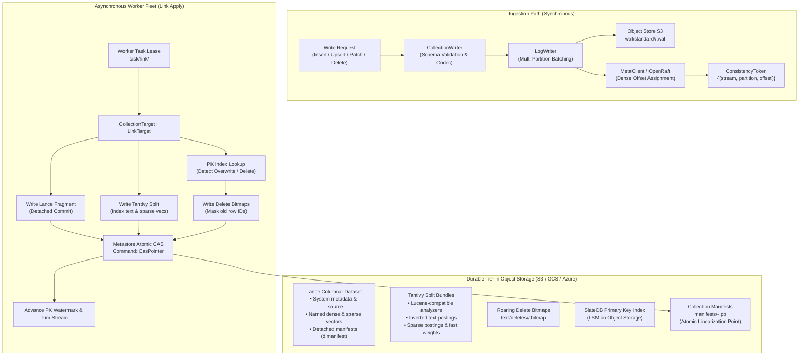
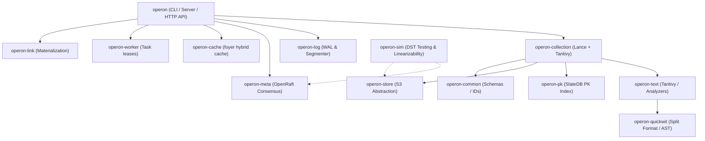
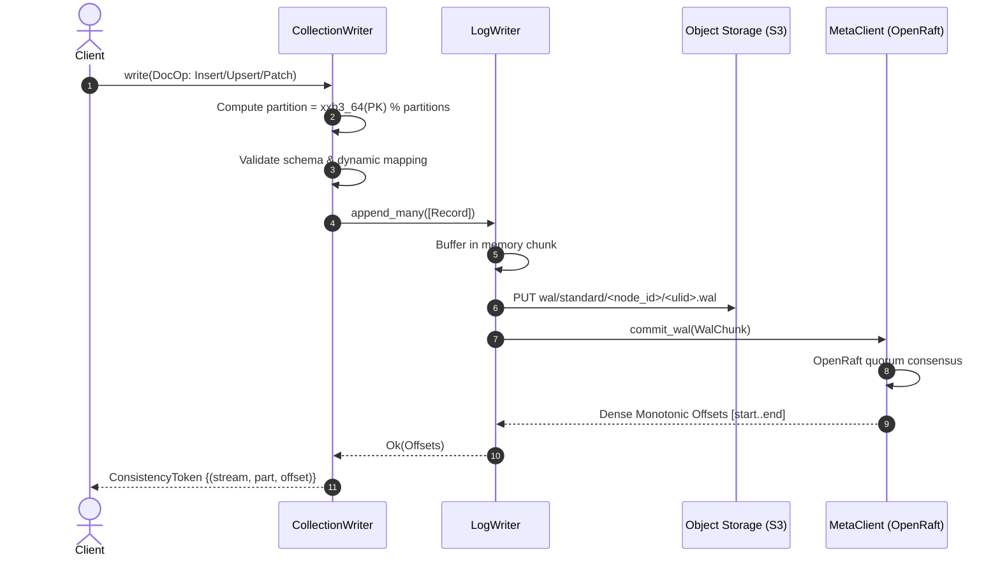
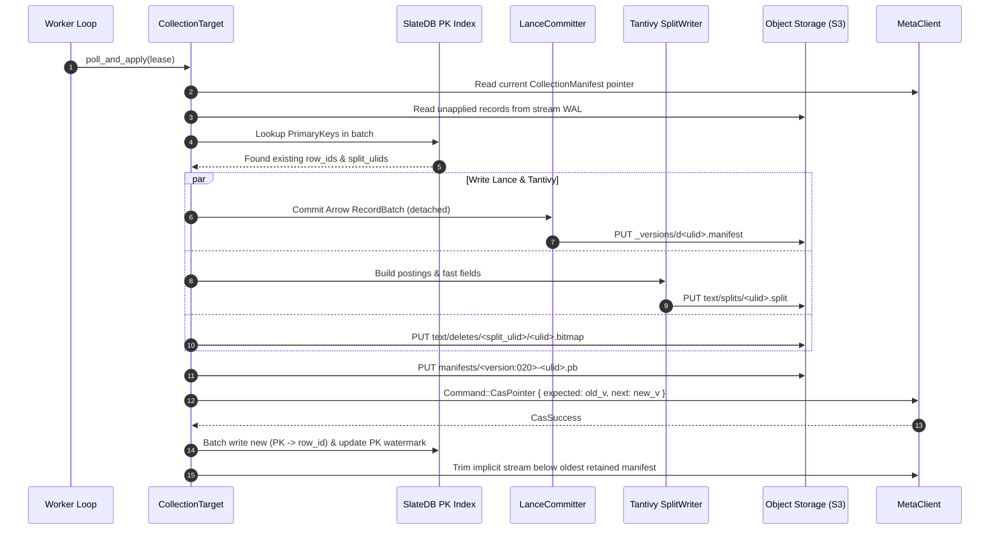
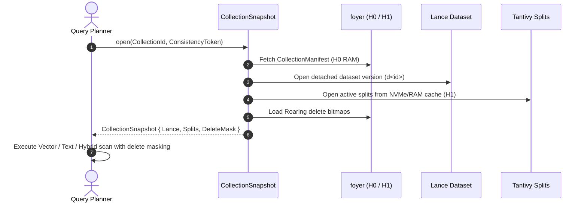

# 01 — Current Implementation Deep Dive & Technical Architecture

**Status:** Complete as of Milestone M1.1 (September 2026)  
**Location:** [`crates/`](file:///home/dinakaran/Documents/Operon/crates)  
**Authors:** The Operon Engineering Team  

---

## 1. System Mental Model & Architecture

Operon's storage model is built around a single unifying principle:

$$\mathbf{Collection} = \mathbf{Log\ (WAL)} \xrightarrow[\text{Link Worker}]{\text{Atomic Materialization}} \Big(\mathbf{Lance\ Dataset} \;\cup\; \mathbf{Tantivy\ Splits}\Big) \;\text{bound by}\; \mathbf{CollectionManifest}$$

---

## 2. Crate Architecture (All 13 Modules)

The Operon codebase is partitioned into 13 strictly decoupled crates:

### 2.1 [`operon-common`](file:///home/dinakaran/Documents/Operon/crates/operon-common)
* **Purpose:** Core primitive types, schema representations, and time abstractions shared across the entire workspace.
* **Key Types:**
  - Strongly-typed numeric IDs: [`NamespaceId`](file:///home/dinakaran/Documents/Operon/crates/operon-common/src/ids.rs), [`StreamId`](file:///home/dinakaran/Documents/Operon/crates/operon-common/src/ids.rs), [`CollectionId`](file:///home/dinakaran/Documents/Operon/crates/operon-common/src/ids.rs), [`LinkId`](file:///home/dinakaran/Documents/Operon/crates/operon-common/src/ids.rs).
  - Schema system in [`operon_common::schema`](file:///home/dinakaran/Documents/Operon/crates/operon-common/src/schema.rs): [`CollectionSchema`](file:///home/dinakaran/Documents/Operon/crates/operon-common/src/schema.rs), [`FieldSpec`](file:///home/dinakaran/Documents/Operon/crates/operon-common/src/schema.rs), [`VectorSpec`](file:///home/dinakaran/Documents/Operon/crates/operon-common/src/schema.rs), [`SparseVectorSpec`](file:///home/dinakaran/Documents/Operon/crates/operon-common/src/schema.rs), and distance metrics ([`Distance::Cosine`](file:///home/dinakaran/Documents/Operon/crates/operon-common/src/schema.rs), `Dot`, `Euclidean`).

### 2.2 [`operon-store`](file:///home/dinakaran/Documents/Operon/crates/operon-store)
* **Purpose:** Robust, unified abstraction over cloud object storage (`object_store` crate).
* **Key Primitives:**
  - [`Store`](file:///home/dinakaran/Documents/Operon/crates/operon-store/src/lib.rs): Thin wrapper supporting AWS S3, Google Cloud Storage, Azure Blob Storage, and local directories with transparent retry policies.
  - Atomic conditional writes: `put_if_absent` (HTTP 409) and `put_if_match` (HTTP 412 CAS).
  - [`FaultyStore`](file:///home/dinakaran/Documents/Operon/crates/operon-store/src/fault.rs): A deterministic fault-injection engine used to test network partitions, `ErrorAfterApply`, simulated latency, and throttling (`503 SlowDown`).

### 2.3 [`operon-cache`](file:///home/dinakaran/Documents/Operon/crates/operon-cache)
* **Purpose:** Two-tier hybrid cache based on RisingWave's [`foyer`](file:///home/dinakaran/Documents/Operon/Cargo.toml#L29) library.
* **Cache Hierarchy:**
  - **H0 Metadata (RAM):** Hot collection manifests, split footers, and Parquet page headers.
  - **H1 Block Cache (RAM $\to$ local NVMe):** Caches arbitrary byte ranges `(object_path, offset, length)` of remote immutable files.
  - Because objects in S3 are immutable by contract, cache invalidation is never required.

### 2.4 [`operon-meta`](file:///home/dinakaran/Documents/Operon/crates/operon-meta)
* **Purpose:** High-throughput, linearizable metadata consensus state machine.
* **Key Components:**
  - Consensus: Built on [`openraft = "=0.10.0-alpha.34"`](file:///home/dinakaran/Documents/Operon/Cargo.toml#L45).
  - Local Storage: [`redb`](file:///home/dinakaran/Documents/Operon/crates/operon-meta/src/db.rs) pure-Rust ACID key-value store for local Raft logs and vote persistence.
  - Serialization: Zero-copy, compact binary encoding via [`postcard`](file:///home/dinakaran/Documents/Operon/crates/operon-meta/src/codec.rs).
  - State Machine ([`MetaState`](file:///home/dinakaran/Documents/Operon/crates/operon-meta/src/state.rs)): Tracks namespaces, streams, collection catalogs, aliases, cooperative worker leases with fencing epochs, and monotonic partition offset sequencers.

### 2.5 [`operon-log`](file:///home/dinakaran/Documents/Operon/crates/operon-log)
* **Purpose:** Object-storage-native stream engine (replaces Kafka broker storage).
* **Key Components:**
  - [`LogWriter`](file:///home/dinakaran/Documents/Operon/crates/operon-log/src/writer.rs): Batches multi-partition record appends, flushes WAL objects to S3, and commits offset allocations to `operon-meta`.
  - [`Segmenter`](file:///home/dinakaran/Documents/Operon/crates/operon-log/src/segmenter.rs): Background worker consolidating fragmented WAL entries into contiguous, immutable `.seg` segment files.
  - [`operon_log::gc`](file:///home/dinakaran/Documents/Operon/crates/operon-log/src/gc.rs): Reachability-based garbage collection deleting unreferenced WAL files and trimmed segments past their grace period.

### 2.6 [`operon-pk`](file:///home/dinakaran/Documents/Operon/crates/operon-pk)
* **Purpose:** Primary key deduplication and row location index.
* **Key Components:**
  - Backed by **SlateDB** (LSM-tree directly on object storage).
  - Maps `PrimaryKey` $\longrightarrow$ `PkValue { fragment_id, row_id, split_ulid, doc_id }`.
  - Writer fencing ensures only one worker mutates a collection's primary key index at a time.

### 2.7 [`operon-worker`](file:///home/dinakaran/Documents/Operon/crates/operon-worker) & [`operon-link`](file:///home/dinakaran/Documents/Operon/crates/operon-link)
* **Purpose:** Cooperative background task orchestration and exactly-once stream-to-target materialization.
* **Key Components:**
  - Cooperative leases with TTL expiration and fencing tokens.
  - [`CollectionTarget : LinkTarget`](file:///home/dinakaran/Documents/Operon/crates/operon-collection/src/target.rs): Consumes records from the log, coordinates Lance/Tantivy writers, and executes atomic manifest CAS commits recording the `applied_offset`.

### 2.8 [`operon-quickwit`](file:///home/dinakaran/Documents/Operon/crates/operon-quickwit) & [`operon-text`](file:///home/dinakaran/Documents/Operon/crates/operon-text)
* **Purpose:** Full-text search and inverted index integration.
* **Key Components:**
  - Quickwit split bundle format, footers, hotcache, and Elasticsearch DSL query parser.
  - Lucene-compatible tokenizers and stemmers (standard, english, whitespace, keyword, original Porter stemmer).
  - Roaring delete bitmaps (`OPDB` envelope) masking superseded documents without rewriting split bundles.

### 2.9 [`operon-collection`](file:///home/dinakaran/Documents/Operon/crates/operon-collection)
* **Purpose:** The core engine unifying Lance and Tantivy under a single manifest.
* **Key Components:**
  - [`DocOp`](file:///home/dinakaran/Documents/Operon/crates/operon-collection/src/doc.rs): Insert, Upsert, Update/Patch, Delete records with dense and sparse vectors.
  - [`LanceCommitter`](file:///home/dinakaran/Documents/Operon/crates/operon-collection/src/lance.rs): Manages detached Lance dataset version commits (`_versions/d<id>.manifest`).
  - [`CollectionManifest`](file:///home/dinakaran/Documents/Operon/crates/operon-collection/src/manifest.rs): Enveloped protobuf manifest (`OPCM`).
  - [`IndexBuildSource`](file:///home/dinakaran/Documents/Operon/crates/operon-collection/src/index_build.rs): Worker source planning delta Lance vector indexes.
  - [`CollectionGcRoots`](file:///home/dinakaran/Documents/Operon/crates/operon-collection/src/gc.rs): Computes exact Lance and Tantivy reachability from retained manifests.

### 2.10 [`operon-sim`](file:///home/dinakaran/Documents/Operon/crates/operon-sim)
* **Purpose:** Deterministic Simulation Testing (DST) harness.
* **Key Components:**
  - Seeded simulation running multi-node clusters over an in-memory `Router`.
  - Injects network drops, node crashes, worker partitions, and object store errors.
  - **Wing–Gong–Lowe Linearizability Checker:** Verifies that all observed read/write histories across sequencers and manifest CAS pointers are strictly linearizable.

---

## 3. Core Architectural Invariants & Decisions

### 3.1 Detached Lance Lineage (Decision D34)
* **The Problem:** Upstream Lance uses a mainline commit model (`1.manifest`, `2.manifest`) where concurrent writers rebase or fail with version conflicts.
* **The Solution:** Operon enforces that Lance datasets have **only one mainline version** (version 1). Every subsequent commit is written as a **detached version** (`_versions/d<id>.manifest`).
* **The Invariant:** The Operon `CollectionManifest` CAS in `operon-meta` is the **sole linearization point** of the system.

### 3.2 Stable Row IDs Unifying Lance and Tantivy (Decision D36)
* **The Problem:** Lance stores columnar data and dense vectors; Tantivy stores text terms and fast fields. Joining them must not introduce foreign key overhead or break on compaction.
* **The Solution:** Splits record Lance's stable row ID in a `_rowid` fast field.
* **The Invariant:** Even when Lance compacts or re-clusters vector fragments, row IDs remain stable, ensuring Tantivy split postings never need rewriting upon compaction.

### 3.3 Dual Sparse Vector Storage (Decision D41)
* **Dense Vectors:** Stored as FixedSizeList columns in Lance.
* **Sparse Vectors:** Dual-written as:
  1. An Arrow Struct column in Lance (`_sparse_<name>: Struct<indices: List<u32>, values: List<f32>>`) as the durable source of truth.
  2. Postings (`_sparse.<name>`) and fast weights (`_sparse_w.<name>`) inside Tantivy splits.
* **The Result:** Enables exact dot-product scoring and BM25-style IDF weighting directly inside search loops without requiring an external sparse vector index.

---

## 4. End-to-End Data Flows

### 4.1 Synchronous Ingest Sequence

---

### 4.2 Asynchronous Link Materialization Sequence

---

### 4.3 Snapshot Read Sequence

---

## 5. Verification & Testing Standards

All code currently in the repository adheres to the following test gates:

1. **Crash Gates (`failpoints`):** Evaluated in [`crates/operon/tests/crash.rs`](file:///home/dinakaran/Documents/Operon/crates/operon/tests/crash.rs) via `std::process::abort()` across 12 distinct failpoints, guaranteeing that kill -9 at any stage of writing or committing leaves zero torn state.
2. **Fault Matrix:** Evaluated in [`crates/operon/tests/fault_matrix.rs`](file:///home/dinakaran/Documents/Operon/crates/operon/tests/fault_matrix.rs) crossing 7 component operations with S3 errors, 409/412 preconditions, and 2-second delays across 336 cells.
3. **Linearizability Suite:** Evaluated in [`operon-sim`](file:///home/dinakaran/Documents/Operon/crates/operon-sim) over 64 seeded runs executing thousands of concurrent operations verified against the Wing–Gong–Lowe linearizability oracle.
