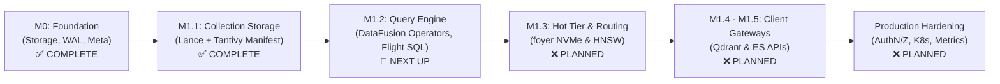
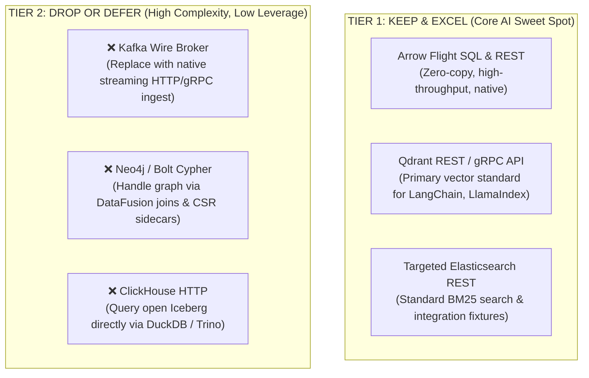
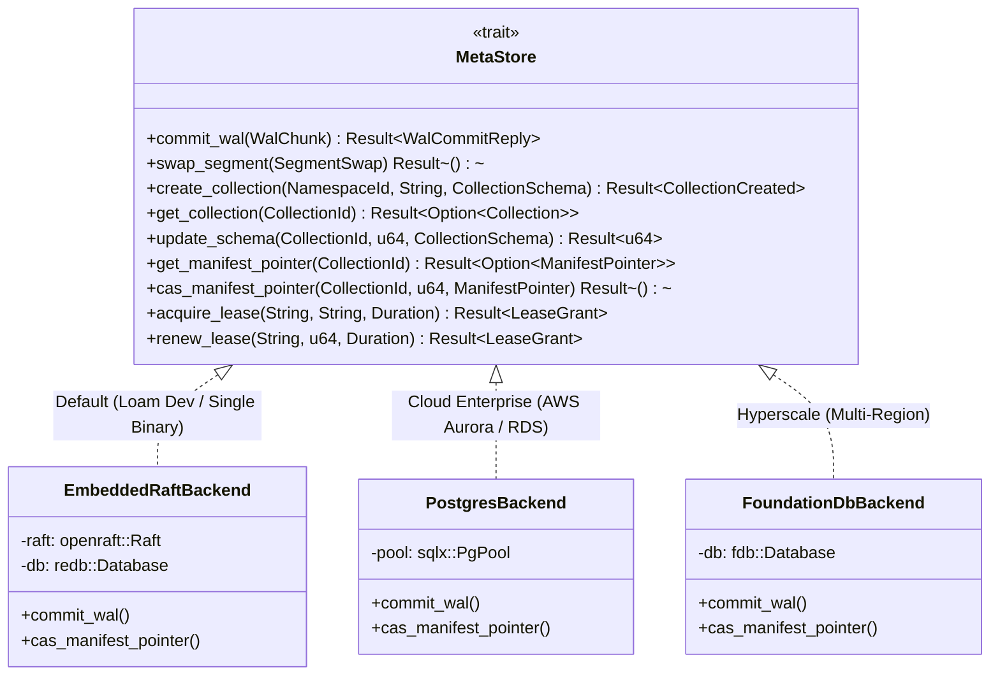
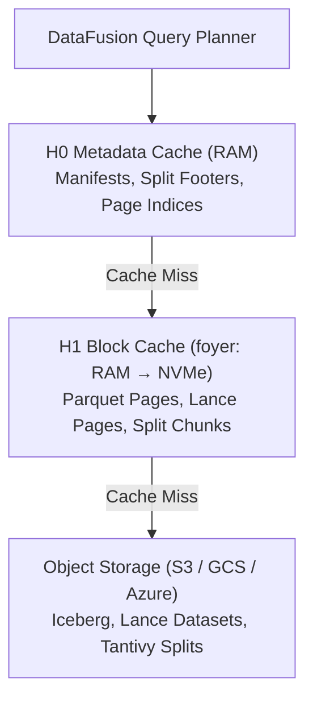

# 02 — Architecture Review, Scope Triage & Metastore Strategy

**Status:** Strategic Architecture Guidance  
**Target:** Milestone M1.2+ Planning  
**Related Documents:** [`01 Architecture`](file:///home/dinakaran/Documents/Operon/docs/design/01-architecture.md), [`13 Decision Log`](file:///home/dinakaran/Documents/Operon/docs/design/13-decision-log.md)  

---

## 1. Production Readiness Assessment

> ### Executive Verdict: NOT Ready for Production
> Operon is in active pre-alpha foundation development (**v0.0.1, Milestone M1.1**). The underlying storage and consensus primitives are exceptionally sound, but the system lacks the query execution engine, network clustering, security, and operational observability required for production workloads.

### Readiness Gap Analysis
1. **Query Engine Missing:** The system can ingest and materialize documents into Lance and Tantivy formats, but the query execution engine ([`operon-query`](file:///home/dinakaran/Documents/Operon/docs/plans/2026-09-24-m1.2-query-engine.md)) has not been built.
2. **Single-Node Topology:** Currently runs as an embedded single-node Raft instance (`NODE_ID = 1`). Multi-node network RPC and rendezvous affinity routing are scheduled for M1.3 and M5.
3. **No AuthN / AuthZ:** No API key management, TLS, mTLS, or role-based access control.
4. **No Production Observability:** Missing Prometheus metric exporters, OpenTelemetry distributed tracing, and automated health checks.

---

## 2. Protocol Scope Strategy: Narrowing the Surface

### The "Five-Product" Compatibility Trap
The original vision of Operon proposed simultaneous compatibility with five distinct enterprise systems:
* **Kafka** (wire protocol broker)
* **Elasticsearch** (full REST query DSL)
* **Qdrant** (REST and gRPC vector APIs)
* **Neo4j / Bolt** (Cypher graph language & Bolt 5.x protocol)
* **ClickHouse** (HTTP interface & SQL dialect)

**The Reality:** Each of these protocols represents a decade of distributed edge cases, specialized query optimizers, and extensive client SDK quirks. Attempting to emulate all five in an early-stage engine guarantees **scope death**—spreading engineering capacity too thin to achieve production stability on any single interface.

### The Recommended Scope Triage

#### 1. Keep Arrow Flight SQL & Native REST
* Built natively on Apache DataFusion and Arrow.
* Delivers zero-copy columnar retrieval with native client bindings in Python, Go, Java, and C++.

#### 2. Keep Qdrant REST & gRPC
* Modern, strictly typed, and the de facto standard for vector search in AI frameworks.
* Unlocks 90% of vector-store integrations with minimal protocol overhead.

#### 3. Keep a Targeted Elasticsearch REST Subset
* Implement strictly what is needed for BM25 text queries and standard vector-store testing fixtures. Do not attempt full ES DSL parity.

#### 4. Drop the Kafka Wire Broker
* Rebuilding Kafka’s broker protocol (KIP-848, consumer group rebalancing, heartbeat loops, transactions) requires a massive dedicated team.
* Instead, provide a clean, high-performance streaming ingest endpoint (`POST /v1/namespaces/{ns}/streams/{stream}/records`) or a lightweight Kafka Connect Sink forwarder.

#### 5. Drop Neo4j Bolt & Cypher
* AI applications rarely need arbitrary 10-hop recursive Cypher queries. They need **GraphRAG** (vector seed $\to$ 1–2 hop neighbor expansion $\to$ rerank).
* Handle graph expansion using DataFusion operators over CSR/CSC sidecars without emulating the Bolt protocol.

#### 6. Drop ClickHouse HTTP
* Operon stores tabular data in **Apache Iceberg**.
* Rather than building a ClickHouse HTTP server inside Operon, advertise that users can query Iceberg tables directly using **DuckDB**, **Trino**, or **ClickHouse itself**.

---

## 3. Metastore Strategy: The Lakekeeper Trait Model

> **Recommendation:** Follow the Lakekeeper pattern. Abstract the metastore behind a high-level **Semantic Trait**. Keep OpenRaft as the default for developer simplicity, while enabling PostgreSQL and FoundationDB for enterprise scale.

### Why Avoid a Raw Key-Value Trait
A low-level KV trait (`get`, `put`, `cas`) forces every backend to reinvent distributed locking, monotonic offset sequencers, and CAS retry loops over raw bytes. Instead, define a **Semantic Metastore Trait** that encapsulates Operon's specific consensus requirements:
* **Sequencing:** Monotonic partition offset allocation.
* **Catalog:** Namespace and collection schema tracking.
* **Linearization:** Atomic manifest pointer compare-and-swap (CAS).
* **Coordination:** Fenced worker leases with TTL expiration.

### Backend Roles & Roadmap
1. **Embedded OpenRaft (`operon-meta` — Active Today):**
   * Keep what is already built and passes 100% of M0 exit gates.
   * Delivers an unmatched developer experience: zero dependencies, boots in milliseconds.
2. **PostgreSQL Adapter (`operon-meta-postgres` — Planned for M5):**
   * The ideal enterprise backend: supported by every cloud provider (AWS Aurora, GCP Cloud SQL, Azure Database).
   * Monotonic sequencer via row updates with `RETURNING`.
   * Manifest CAS via single atomic `UPDATE ... WHERE version = $expected`.
3. **FoundationDB Adapter (`operon-meta-fdb` — Future Hyperscale):**
   * Reserved for hyper-growth tiers requiring millions of metadata mutations per second across multiple data centers.

---

## 4. Lessons from StarRocks & Nebula Graph

### 4.1 StarRocks Data Cache: Validating the Hot Tier
StarRocks proved that lakehouse query engines do not need stateful local storage to achieve sub-second analytical latencies. By keeping data in open Apache Iceberg on S3 and employing a **two-tier (RAM + local NVMe) Data Cache**, StarRocks delivers memory-speed queries at object-storage costs.

Operon's hot-tier architecture ([docs/design/04-hot-tier.md](file:///home/dinakaran/Documents/Operon/docs/design/04-hot-tier.md)) mirrors this exact pattern via [`operon-cache`](file:///home/dinakaran/Documents/Operon/crates/operon-cache) (using RisingWave's `foyer`):

**Operon’s Extension:** Applying the StarRocks Data Cache model uniformly across tabular data (Iceberg), vector data (Lance), and full-text search (Tantivy).

### 4.2 Nebula Graph vs. The GraphRAG Sweet Spot
Nebula Graph is a powerful distributed graph database, but running it in production requires managing three separate stateful daemons (`metad`, `graphd`, and stateful multi-Raft `storaged` over RocksDB), creating operational friction and data silos.

**Operon's Object-Native Graph Alternative:**
* Store entities as rows in Lance/Iceberg tables with vector embeddings.
* Store edges in chunked CSR/CSC (Compressed Sparse Row/Column) sidecars on S3.
* Cache hot adjacency chunks in local NVMe via `foyer`.
* Execute 1–2 hop GraphRAG traversals in the same planned query as vector search:
  $$\text{AnnExec (Vector)} \longrightarrow \text{ExpandExec (Graph)} \longrightarrow \text{Projection}$$
  with zero separate graph database clusters and zero network serialization.
