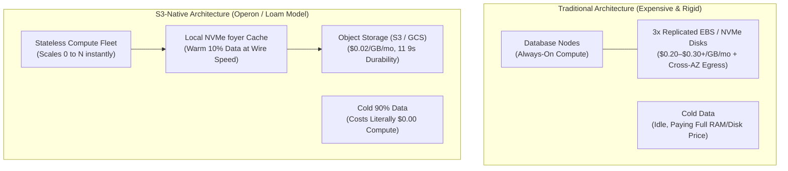
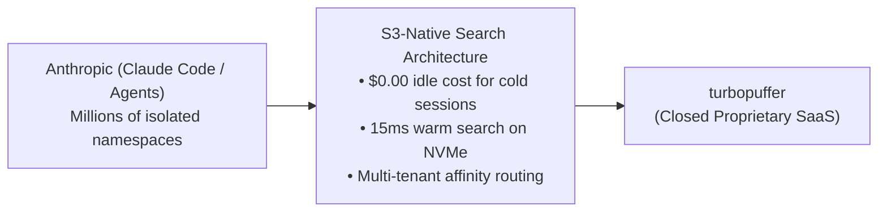
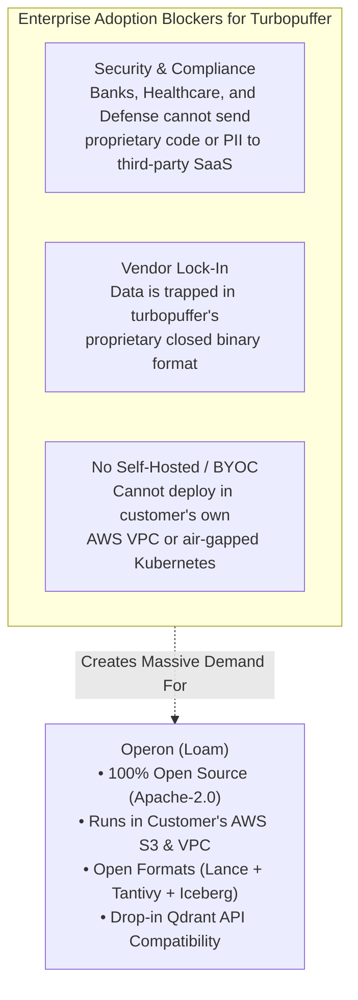
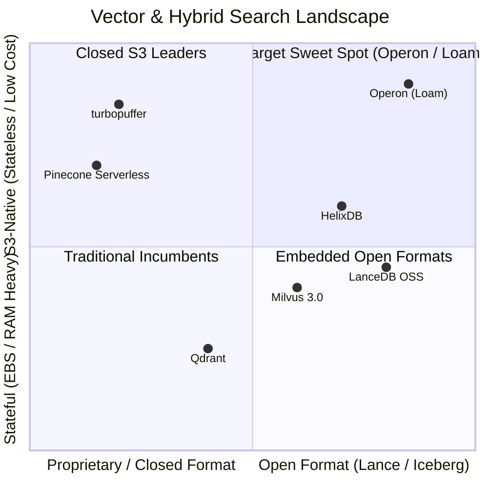

# 03 — Market Landscape, Competitors & The Turbopuffer Opportunity

**Status:** Strategic Market Analysis  
**Focus:** S3-Native Search & Vector Infrastructure  
**Core Reference:** The "Open-Source Turbopuffer" Thesis  

---

## 1. The Macro Shift: The S3-Native Infrastructure Boom

Over the last 24 months, cloud data infrastructure has undergone a fundamental architectural transformation: **migrating from stateful, multi-AZ replicated block storage (EBS/NVMe) to stateless compute over object storage (S3/GCS/Azure).**

### Why S3-Native Wins:
1. **80%–90% Infrastructure Cost Reduction:** S3 costs ~$0.02/GB/month. Multi-AZ EBS with 3× replication and cross-AZ network traffic costs $0.20–$0.30+/GB/month.
2. **Instant Elasticity:** Stateless compute nodes autoscale in seconds based on CPU/query load without requiring hours of partition rebalancing or disk resharding.
3. **The "Cold Data" Reality of AI:** In AI applications (agent workspaces, code copilots, user-specific RAG), **over 95% of data is cold**. Paying memory or replicated disk prices for inactive agent memories is economically unsustainable.

---

## 2. The Turbopuffer Phenomenon & Why Anthropic Uses It

### 2.1 The "Millions of Namespaces" Problem
Before turbopuffer, vector databases (Pinecone, Milvus, Weaviate, Qdrant) assumed a few monolithic collections running on always-on server clusters.

Anthropic ran into the **"Millions of Namespaces"** problem with Claude Code and AI agents:
* Every user, every codebase index, and every agent session requires its **own isolated search index**.
* Provisioning thousands of dedicated vector database clusters resulted in millions of dollars spent on idle compute and memory.
* **Turbopuffer solved this with an object-storage-native architecture:**
  - Cold namespaces sit in S3 at **$0.00 compute cost**.
  - When an agent queries a namespace, compute nodes fetch index metadata and cache hot blocks in NVMe via affinity routing, answering queries in 10–20ms.

---

## 3. The Multi-Billion Dollar Gap: Turbopuffer is Closed-Source

While Anthropic partnered directly with turbopuffer, **the rest of the enterprise market cannot adopt a closed-source SaaS for core retrieval**:

1. **Security & Data Sovereignty:** Highly regulated enterprises (finance, healthcare, government, enterprise SaaS) have strict infosec mandates: *"All data must reside inside our AWS VPC, in our own S3 bucket."*
2. **Open Formats at Rest:** Enterprises refuse to be locked into proprietary black-box formats. Operon stores data in **Apache Iceberg**, **Lance**, and **Tantivy**, ensuring data can always be read directly by DuckDB, Trino, or Python.
3. **VPC & On-Premises Deployability:** There is currently **no open-source turbopuffer alternative** that platform engineering teams can deploy inside their own cloud perimeter.

---

## 4. In-Depth Competitor Breakdown

### 4.1 LanceDB (Closest Open-Source Ecosystem Peer)
* **What they do:** Built around the open-source Lance columnar vector format. Raised $41M ($30M Series A led by Theory Ventures).
* **The Catch:** LanceDB open source is primarily an **embedded library** (like SQLite) or a client-side reader over S3 files. 
  * Their distributed, multi-tenant serving layer (**LanceDB Enterprise**) is **closed-source proprietary SaaS**.
  * LanceDB lacks a distributed WAL-on-S3 with crash-consistent multi-partition sequencing, and its text search (Lance FTS) lacks the Lucene-level BM25 maturity of Tantivy.

### 4.2 Milvus 3.0
* **What they do:** An open-source vector database designed for billion-scale deployments, adding "lake-native collections" over Lance/Iceberg and a zero-disk WAL ("Woodpecker").
* **The Weakness:** **High operational complexity.** Running Milvus requires deploying and managing 8+ distinct distributed services (etcd, Pulsar/Kafka, MinIO, QueryNodes, DataNodes, IndexNodes, Proxy, MixCoord). It is too heavy for nimble serverless deployments.

### 4.3 HelixDB
* **What they do:** An open-source graph-vector database written in Rust, using SlateDB as its S3 LSM storage layer and `foyer` for NVMe caching.
* **The Weakness:** Stores all data in SlateDB LSM-tree SST files, rather than open columnar Parquet/Lance formats readable by external analytical tools.

### 4.4 Amazon S3 Vectors
* **What they do:** AWS’s native vector indexing feature built directly into S3 buckets.
* **The Weakness:** High query latency (>100ms, suitable only for asynchronous RAG), hard limits (top-$k \le 100$), no hybrid BM25 full-text fusion, and closed AWS API lock-in.

---

## 5. Comprehensive Feature Comparison Matrix

| Capability | turbopuffer | LanceDB (OSS) | Milvus 3.0 | HelixDB | **Operon (Loam)** |
|---|:---:|:---:|:---:|:---:|:---:|
| **License** | Proprietary SaaS | Apache-2.0 | Apache-2.0 | Apache-2.0 | **Apache-2.0** |
| **Primary Storage** | S3 (Closed format) | Lance files | S3 / Lance / Iceberg | S3 (SlateDB SSTs) | **S3 (Lance + Tantivy + Iceberg)** |
| **In-VPC / BYOC Deployable** | ❌ No | ⚠️ Embedded only | ⚠️ Heavy K8s (8+ pods) | ⚠️ Early stage | **✅ Yes (Stateless Agent / Binary)** |
| **Hybrid Search (Vector + BM25)** | ✅ Yes | ⚠️ Basic FTS | ⚠️ Complex setup | ⚠️ Basic | **✅ Native (Lance + Tantivy WAND)** |
| **Leaderless Multi-Partition WAL** | ✅ Yes | ❌ No | ⚠️ Woodpecker | ❌ SlateDB WAL | **✅ Native S3 WAL (`operon-log`)** |
| **Read by External Engines** | ❌ Impossible | ⚠️ Lance only | ⚠️ Partial | ❌ No (LSM files) | **✅ Yes (DuckDB, Trino, PyIceberg)** |
| **Zero Idle Cost ($0.00 Cold)** | ✅ Yes | ✅ Yes (Client only) | ❌ High cluster cost | ⚠️ SlateDB cost | **✅ Yes (Full serverless S3 tier)** |
| **Standard API Compatibility** | Custom REST | Custom Python/TS | Custom gRPC | Custom | **Qdrant REST/gRPC + Flight SQL** |

---

## 6. Operon’s Strategic Moat

Operon occupies the most defensible, unserved position in the market:

1. **The turbopuffer Cost Model:** Zero idle cost on S3 with sub-20ms NVMe caching via `foyer`.
2. **Open Formats at Rest:** Lance for vectors + Tantivy for BM25 + Iceberg for analytics (guaranteeing zero vendor lock-in).
3. **The BYOC Security Model:** Customer data never leaves their AWS VPC, bypassing enterprise security review delays.
4. **Drop-in Standard APIs:** Speaks the Qdrant API and Arrow Flight SQL natively, enabling existing LangChain, LlamaIndex, and enterprise applications to switch with zero code refactoring.
