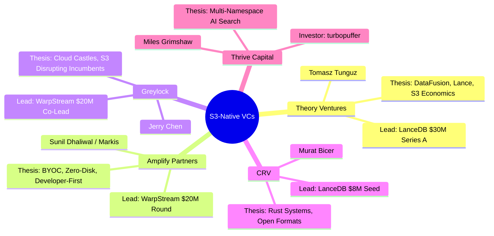
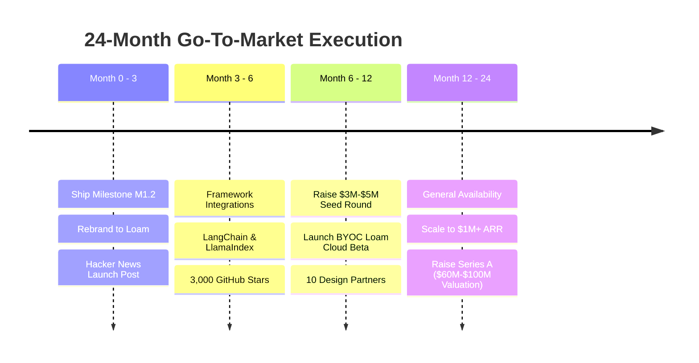
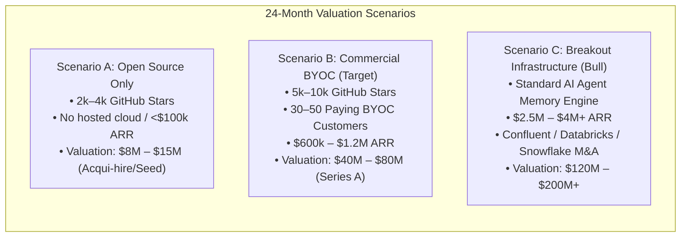

# 04 — Commercial Strategy, BYOC Architecture & Venture Capital Roadmap

**Status:** Business Strategy & GTM Playbook  
**Target:** 24-Month Commercial Execution ($100M+ Valuation)  
**Model:** Open-Core / Bring Your Own Cloud (BYOC) SaaS  

---

## 1. The BYOC (Bring Your Own Cloud) Model

The single most effective commercial architecture for modern data infrastructure (proven by WarpStream, Databricks, and ClickHouse Cloud) is **Bring Your Own Cloud (BYOC)**.

```mermaid
flowchart TD
    subgraph CustomerVPC ["Customer's Cloud Perimeter (Data Plane)"]
        App["Customer AI Application\n(LangChain / Python / Go)"] -->|Qdrant API / Flight SQL (<1ms)| AgentPool
        
        subgraph AgentPool ["Stateless Loam Agent Fleet"]
            Agent1["Loam Agent Pod 1\n(foyer NVMe Cache)"]
            Agent2["Loam Agent Pod 2\n(foyer NVMe Cache)"]
        end

        AgentPool -->|Direct S3 I/O| S3Bucket["Customer S3 / GCS Bucket\n• Lance Vector Files\n• Tantivy Split Bundles\n• Apache Iceberg Tables\n*** DATA NEVER LEAVES VPC ***"]
    end

    subgraph LoamCloud ["Loam Cloud SaaS (Control Plane Managed by You)"]
        ControlPlane["Hosted Control Plane\n• Metadata Orchestration\n• Lease Allocator & Coordination\n• Schema Registry\n• Consumption Metering & Billing\n• Fleet Management Dashboard"]
    end

    AgentPool -.->|Outbound-Only TLS Metadata & Heartbeats\n(ZERO Raw Data)| ControlPlane
```

### Why BYOC Wins Over Traditional Database SaaS:
1. **Bypasses the 6-Month Enterprise Infosec Review:** Enterprise security teams routinely block SaaS databases because customer PII and code would be stored on third-party servers. In BYOC, **customer data never leaves their AWS VPC**. You store zero customer data.
2. **Zero Ingress / Egress Bandwidth Costs for You:** In traditional vector SaaS, you pay AWS bills for customer network transfers. With BYOC, **the customer pays their own AWS compute and S3 storage bills directly**.
3. **85%–90% Gross Margins:** Because you only run a lightweight metadata control plane, your infrastructure COGS is negligible.
4. **Monetization Mechanics:**
   * **Open Source:** Free self-hosted for developers.
   * **Loam BYOC Cloud:** Consumption-based pricing ($0.05 per GB of data written / scanned) or a node management fee ($50/month per active agent pod).

---

## 2. Target VCs Who Invest in S3-Native Infrastructure

These firms have an active investment thesis around S3-native infrastructure, DataFusion, and modern data platforms:



| Firm | Partner | Notable Investments | Strategic Alignment |
|---|---|---|---|
| **Theory Ventures** | **Tomasz Tunguz** | **LanceDB** ($30M Series A) | The most prominent analyst and investor in DataFusion, Rust data engines, and Lance format. |
| **Amplify Partners** | **Sunil Dhaliwal** | **WarpStream**, **Temporal**, **Datadog**, **dbt Labs** | Led WarpStream before its $200M+ acquisition by Confluent; explicitly focuses on BYOC developer infrastructure. |
| **Greylock** | **Jerry Chen** | **WarpStream** | Focuses on cloud-native infrastructure that disrupts incumbent stateful systems. |
| **CRV** | **Murat Bicer** | **LanceDB** ($8M Seed) | Demonstrated conviction in early-stage Rust vector formats. |
| **Thrive Capital** | **Miles Grimshaw** | **turbopuffer** | Understands the massive market demand proven by Anthropic's adoption. |

---

## 3. Go-To-Market (GTM) Playbook



### Phase 1: The Technical Launch (Months 1–3)
* Complete Milestone M1.2 (hybrid query engine).
* Rebrand mechanically to **Loam** ([Decision D33](file:///home/dinakaran/Documents/Operon/docs/design/13-decision-log.md#L41)).
* **Launch Post on Hacker News:**
  `Show HN: Loam – Open-Source, S3-Native Alternative to turbopuffer (Rust + Lance + Tantivy)`
* Focus the narrative on the **90% cost reduction** achieved by running vector and text retrieval on customer S3 buckets.

### Phase 2: Winning Developer Frameworks (Months 3–6)
* Ship drop-in vector store integrations for:
  - **LangChain & LlamaIndex:** `from langchain_community.vectorstores import Loam`
  - **Vercel AI SDK:** Serverless vector retrieval for Next.js AI apps.
  - **Claude Code & Agent Fleets:** Tutorials demonstrating persistent agent memory with zero idle cost.

### Phase 3: The Design Partner Program (Months 6–12)
* Recruit **5–10 AI scaleups** spending $5k–$30k/month on Pinecone, Qdrant Cloud, or Elastic Cloud.
* Deploy Loam BYOC inside their AWS VPC and cut their retrieval bill by 75%.
* Publish joint case studies demonstrating real-world latency and cost savings.

---

## 4. 24-Month Valuation Models

In data infrastructure, valuation at 24 months is driven by **developer adoption**, **Annual Recurring Revenue (ARR)**, and **strategic M&A value**:



### Valuation Benchmarks:
* **The Seed Round (Month 6–9):** Raise **$3M–$5M** at a **$18M–$25M post-money valuation** based on open-source momentum, initial design partners, and team caliber.
* **The Series A Round (Month 18–24):** Raise **$15M–$25M** at a **$50M–$80M valuation** based on $500k–$1M ARR growing 20%+ month-over-month.

---

## 5. Seed Fundraising Pitch Deck Outline

When pitching Tomasz Tunguz, Amplify Partners, or Greylock, structure your 10-slide deck as follows:

1. **The Hook:** AI applications generate millions of dynamic collections (agent sessions, user repositories) where 95% of data is cold. Traditional databases charge full price for idle data.
2. **The Incumbents:** Pinecone, Qdrant, and Elastic were built on pre-S3 architectures with 3× replicated EBS disks and always-on compute.
3. **The Proof:** Anthropic saw this flaw and chose **turbopuffer**. But turbopuffer is closed-source, proprietary SaaS that banks and enterprises cannot legally use.
4. **The Solution (Loam):** The open-source turbopuffer. Sub-20ms hybrid search directly on customer S3 buckets using open formats (Lance + Tantivy + Iceberg).
5. **The Secret Sauce:** Dual Lance + Tantivy storage under an atomic manifest, backed by RisingWave's `foyer` NVMe cache.
6. **The Business Model:** Open-source core $\longrightarrow$ BYOC Cloud SaaS for enterprise deployments (85%+ gross margins).
7. **Traction & Validation:** 100% test matrix, crash consistency under kill -9, initial design partners.
8. **The Team:** World-class Rust systems programming and distributed database expertise.
9. **The Ask:** $4M Seed round to build out Loam Cloud and scale enterprise adoption.
