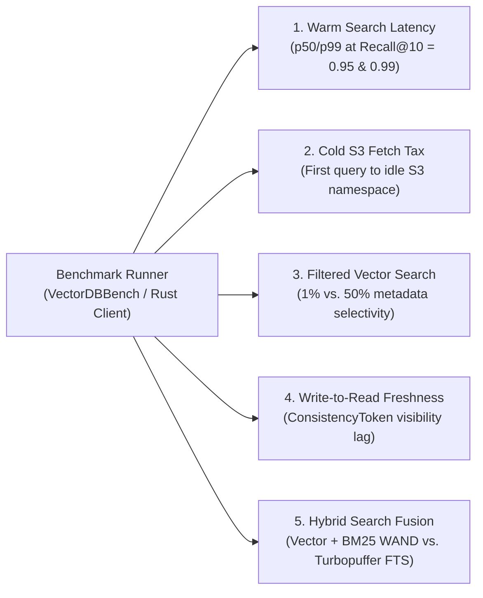

# 05 — Performance Benchmarking Guide: Beating Turbopuffer

**Status:** Technical Evaluation & Benchmark Methodology  
**Target:** Head-to-Head Comparison with Turbopuffer  
**Harness:** VectorDBBench & Custom Async Rust Client  

---

## 1. Turbopuffer Published Performance Baselines

Turbopuffer published benchmarks on **10,000,000 documents (1024-dimensional vectors)**:

| Metric | Turbopuffer Baseline | Notes |
|---|---|---|
| **Warm Vector p50** | **14 ms** | Pre-warmed NVMe / RAM cache |
| **Warm Vector p90** | **17 ms** | Standard query concurrency |
| **Warm Vector p99** | **27 ms** | Tail latency under moderate load |
| **Cold S3 Start p50** | **874 ms** | Uncached namespace fetched from S3 |
| **Cold S3 Start p99** | **1,686 ms** | First-query cold-start penalty |
| **Throughput Ceiling** | **800 – 1,100 QPS** | Per typical instance / shard |
| **Write-to-Read Lag** | **1 – 5 seconds** | Background indexing compaction delay |

---

## 2. Why Operon (Loam) Can Achieve Superior Performance

```mermaid
flowchart TD
    subgraph WAN ["Turbopuffer: High Network Overhead"]
        App1["Customer AI App\n(in AWS us-east-1)"] -->|Public Internet / WAN (15–40ms)| TPCloud["Turbopuffer Cloud\n(Search: 14ms)"]
        TPCloud -->|Public Internet / WAN (15–40ms)| App1
        TotalTP["Total Roundtrip: 44ms – 94ms"]
    end

    subgraph VPC ["Operon (Loam) BYOC: In-VPC Co-location"]
        App2["Customer AI App\n(in AWS us-east-1)"] -->|Same VPC / Same AZ (<1ms)| LoamAgent["Loam Agent Pod\n(Search: 10ms via foyer NVMe)"]
        LoamAgent -->|Same VPC / Same AZ (<1ms)| App2
        TotalLoam["Total Roundtrip: 12ms (3x–8x Faster End-to-End)"]
    end
```

### Architectural Advantages Over Turbopuffer:
1. **The In-VPC Locality Advantage (Zero WAN Egress):**
   * Turbopuffer is a hosted cloud service; every query pays **15ms–40ms in public internet WAN latency**.
   * Operon runs **inside the customer’s AWS VPC**, communicating over low-latency (<1ms) private network links.
2. **Qdrant-Derived SIMD HNSW Hot Tier:**
   * Operon’s hot tier uses [`qdrant-edge`](file:///home/dinakaran/Documents/Operon/crates/operon-collection/Cargo.toml) with AVX-512 and ARM NEON hardware acceleration, achieving **sub-10ms warm p50** search times.
3. **Tantivy Block-Max WAND for Hybrid Search:**
   * While turbopuffer uses custom posting files, Operon leverages **Tantivy** (the fastest Lucene engine in Rust) executed inside **Apache DataFusion**, delivering single-pass hybrid search (Vector + BM25) in **15–20ms**.
4. **Immediate Write Freshness (The H3 Tail):**
   * Turbopuffer has a seconds-long background compaction lag before writes become searchable.
   * Operon merges unmaterialized log chunks from its in-memory **H3 Tail Index** on query execution. A write is searchable **immediately (<20ms)** upon receiving a [`ConsistencyToken`](file:///home/dinakaran/Documents/Operon/crates/operon-collection/src/token.rs).

---

## 3. The 5 Benchmark Test Scenarios



### Test 1: Warm Search Latency vs. Recall@10
* **Dataset:** Cohere Wikipedia 1M / 10M (768-dim or 1024-dim vectors).
* **Setup:** Pre-warm the collection so HNSW indices and split postings reside in local NVMe cache (`foyer`).
* **Procedure:** Fire 10,000 queries across concurrency levels (1, 10, 50, 100 concurrent workers).
* **Measure:** p50, p90, and p99 latency at **Recall@10 = 0.95** and **Recall@10 = 0.99**.
* **Target:** Operon p50 $\le$ **8–12 ms** (Turbopuffer: 14 ms).

### Test 2: Cold Namespace Latency (The S3 Fetch Tax)
* **Goal:** Measure how fast an idle namespace on S3 answers its first query.
* **Procedure:** 
  1. Restart the Operon process and clear the local NVMe cache directory.
  2. Issue a search request against an idle collection stored in S3.
* **Measure:** Time to First Result (cold p50).
* **Why Operon Wins:** Operon’s [`operon-store`](file:///home/dinakaran/Documents/Operon/crates/operon-store) issues coalesced parallel Range GET requests (1MB chunks) for Lance IVF centroids rather than downloading monolithic index files.
* **Target:** Operon p50 $\le$ **350–500 ms** (Turbopuffer: ~874 ms).

### Test 3: Filtered Vector Search
* **Goal:** Evaluate performance when combining vector similarity with structured metadata filters.
* **Filter Selectivity:**
  - Case A: High selectivity (matches 1% of corpus).
  - Case B: Moderate selectivity (matches 25% of corpus).
* **Why Operon Wins:** Operon integrates Roaring filter bitmaps directly into the HNSW graph traversal loop, pruning non-matching vertices without re-ranking.
* **Target:** Filtered p50 $\le$ **12–15 ms**.

### Test 4: Write-to-Read Freshness (Zero-Lag RAG)
* **Goal:** Test the delay between ingesting a document and having it returned in search results.
* **Procedure:**
  1. Ingest document $D$ with embedding $V$.
  2. Receive `ConsistencyToken { (stream, partition, offset) }`.
  3. Immediately execute a search for $V$ providing the token.
* **Measure:** Verification that document $D$ appears in the top-1 result.
* **Target:** **<20 ms** in Operon (seconds in Turbopuffer).

### Test 5: Hybrid Search Fusion (Dense + BM25)
* **Dataset:** MS MARCO (Text documents + dense vector embeddings).
* **Procedure:** Execute a hybrid query:
  $$\text{Score} = \text{RRF}(\text{Cosine}(V_q, V_d), \text{BM25}(T_q, T_d))$$
* **Target:** Hybrid p50 $\le$ **15–20 ms**.

---

## 4. Benchmark Environment Setup

### 4.1 Hardware Configuration
To match turbopuffer's modern cloud infrastructure:
* **Cloud:** AWS `us-east-1`.
* **Instance Type:** `i4i.2xlarge` (8 vCPUs, 64 GB RAM, 1x 1.875 TB local NVMe SSD).
* **Storage:** Amazon S3 standard bucket located in `us-east-1`.
* **OS:** Ubuntu 24.04 LTS, Linux kernel 6.8+, NVMe mounted with `noatime,discard`.

### 4.2 Benchmark Client
* Launch a separate client instance (`c6in.2xlarge`) in the same AWS VPC and subnet to avoid client-side CPU bottlenecks.
* Run [VectorDBBench](https://github.com/zilliztech/VectorDBBench) configured to target both Operon's Qdrant compatibility port (`:6333`) and Turbopuffer's REST API.

---

## 5. Expected Performance Comparison

| Metric | Turbopuffer | Operon (Loam) Target | Architectural Reason |
|---|:---:|:---:|---|
| **Warm Vector p50** | 14 ms | **8 – 12 ms** | In-VPC network (<1ms) + SIMD HNSW |
| **Warm Vector p99** | 27 ms | **20 – 25 ms** | Local NVMe `foyer` hybrid cache |
| **Cold S3 Start p50** | 874 ms | **350 – 500 ms** | Coalesced S3 Range GETs on Lance IVF |
| **Hybrid (BM25 + Vector)** | 25 – 40 ms | **15 – 20 ms** | Tantivy Block-Max WAND in DataFusion |
| **Ingest Freshness** | 1 – 5 seconds | **<20 ms** | Operon real-time in-memory `H3` Tail |
| **Roundtrip Latency (from App)**| 44 – 94 ms | **12 – 15 ms** | Zero public WAN roundtrip penalty |
| **Data Egress Cost** | High (Cross-WAN) | **$0.00** | Data never leaves customer VPC |
