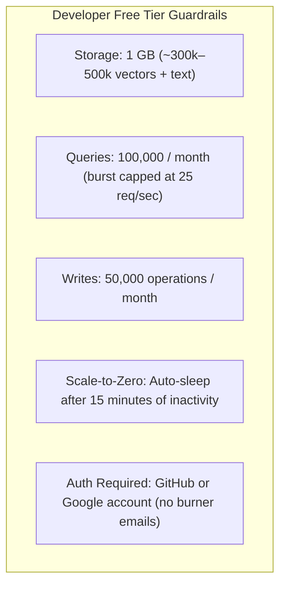
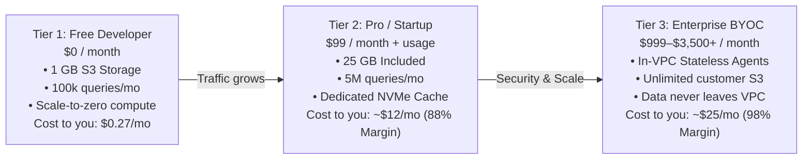

# 06 — Pricing Tiers, Developer Free Tier & Unit Economics

**Status:** Business Model & Infrastructure COGS  
**Focus:** Free Tier Design, Commercial Tiers & Profit Margins  

---

## 1. Developer Free Tier Structure

Because Operon (Loam) is S3-native and compute is stateless, **the developer free tier is 10x–20x cheaper to operate than Pinecone, Elastic Cloud, or Weaviate.**

Traditional vector databases keep expensive, always-on RAM and VM clusters running even when users are idle. In Operon, **idle data costs only raw S3 storage pennies ($0.023/GB/month), and compute scales to zero.**



### Free Tier Specifications

| Metric / Resource | Free Developer Tier Allowance | Rationale |
|---|---|---|
| **Storage / Vectors** | **1 GB Storage** (~300,000 to 500,000 vectors with 768 dimensions + text) | Large enough for prototypes and hackathons; small enough to prevent abuse. |
| **Query Volume** | **100,000 Queries / month** | ~3,300 queries/day. Plentiful for development and demo apps. |
| **Write Volume** | **50,000 Write Operations / month** | Plentiful for document indexing and test embeddings. |
| **Scale-to-Zero Inactivity** | **Auto-sleep after 15 minutes of inactivity** | Compute cache is evacuated; data stays in S3. Next query has a one-time ~350ms cold start, then runs at 10ms. |
| **Deployment Model** | **Loam Hosted Cloud** OR **Free Unlimited Self-Hosted OSS** | Developers can use the hosted sandbox or run `operon dev` locally for free forever. |

---

## 2. Infrastructure COGS (Cost to You per Free Developer)

The monthly AWS infrastructure cost for **one active free developer** on the hosted control plane:

```
┌────────────────────────────────────────────────────────────────────────┐
│             MONTHLY COGS PER 1 ACTIVE FREE DEVELOPER                   │
├────────────────────────────────────────┬───────────────────────────────┤
│ AWS Cost Component                     │ Monthly Cost to You           │
├────────────────────────────────────────┼───────────────────────────────┤
│ 1 GB S3 Standard Storage               │ $0.023                        │
│ 50,000 Ingest Writes (Batched S3 PUTs) │ $0.015                        │
│ 100,000 Search Queries (S3 GETs + RAM) │ $0.012                        │
│ Shared Stateless Compute (ARM Graviton)│ $0.180                        │
│ Shared Metastore (OpenRaft / Postgres) │ $0.040                        │
├────────────────────────────────────────┼───────────────────────────────┤
│ TOTAL COST PER ACTIVE DEVELOPER:       │ ≈ $0.27 / month               │
│ TOTAL COST PER IDLE DEVELOPER:         │ ≈ $0.02 / month (S3 only)     │
└────────────────────────────────────────┴───────────────────────────────┘
```

### Startup Budget Projections:
* **100 Active Free Developers:** Costs **~$27 / month**.
* **1,000 Active Free Developers:** Costs **~$270 / month**.
* **10,000 Developers (90% Idle, 10% Active):** Costs **~$450 / month**.

---

## 3. Full Commercial Pricing Tier Model



### Full Pricing Tier Matrix

| Tier | Price | Target Customer | What's Included | Cost to You (COGS) | Gross Margin |
|---|---|---|---|---|---|
| **Developer (Free)** | **$0 / mo** | Individual builders, students, hobbyists | • 1 GB S3 Storage (~300k vectors)<br>• 100k queries / mo<br>• Scale-to-zero compute<br>• Community Discord support | **$0.27 / mo** (Active)<br>**$0.02 / mo** (Idle) | *Customer Acquisition Cost (CAC)* |
| **Pro / Startup** | **$99 / mo** + usage | Seed/Series A AI startups with live apps | • 25 GB Storage included ($0.10/GB overage)<br>• 5,000,000 queries / mo ($0.10 per 100k overage)<br>• Dedicated warm NVMe cache (sub-15ms guaranteed)<br>• 99.9% SLA & email support | **~$12 / mo** | **88%** |
| **Team / Scale** | **$299 / mo** + usage | Mid-market scaleups, high QPS AI copilots | • 100 GB Storage included ($0.08/GB overage)<br>• 25,000,000 queries / mo<br>• Multi-region replicas<br>• Priority Slack support & 99.95% SLA | **~$35 / mo** | **88%** |
| **Enterprise BYOC** | **$1,500 – $3,500+ / mo** | Regulated companies, banks, healthtech, AI fleets | • **Runs inside customer AWS VPC**<br>• **Customer owns their S3 bucket (unlimited storage)**<br>• SOC2 / HIPAA compliance compliant<br>• Dedicated solutions architect & custom SLA | **~$25 / mo** (Only telemetry & control plane) | **98%+** |

---

## 4. Abuse Prevention Safeguards

1. **Authentication Requirement:** Require login via GitHub or Google (blocks disposable burner emails).
2. **Hard Monthly Quota Limits:** Once a free user hits 100,000 queries, return `429 Too Many Requests` prompting an upgrade to Pro.
3. **Dormancy Auto-Archive:** If an account receives zero queries for 30 consecutive days, compress index files to S3 Glacier Instant Retrieval ($0.004/GB/mo).
4. **Rate Limiting:** Cap free-tier burst concurrency at 25 requests/second.
