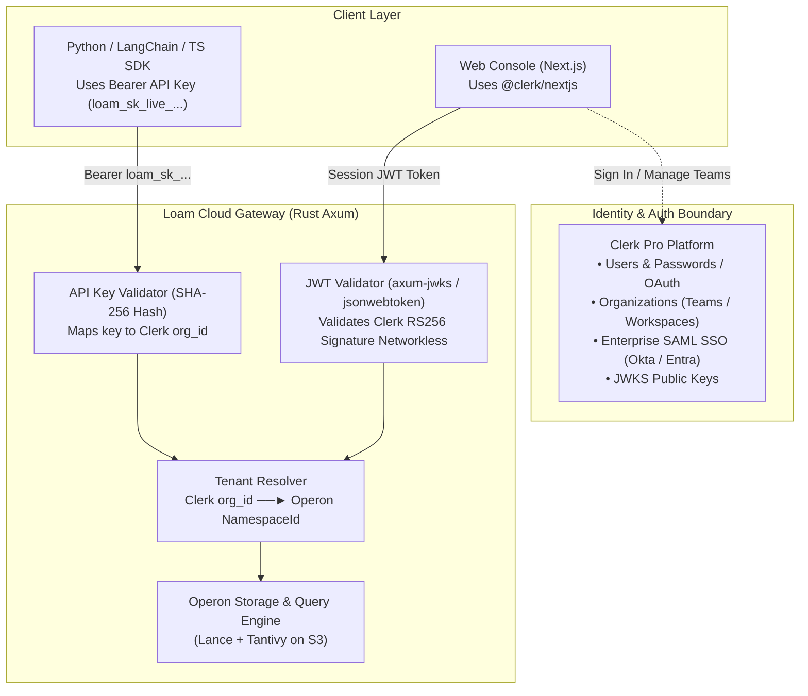
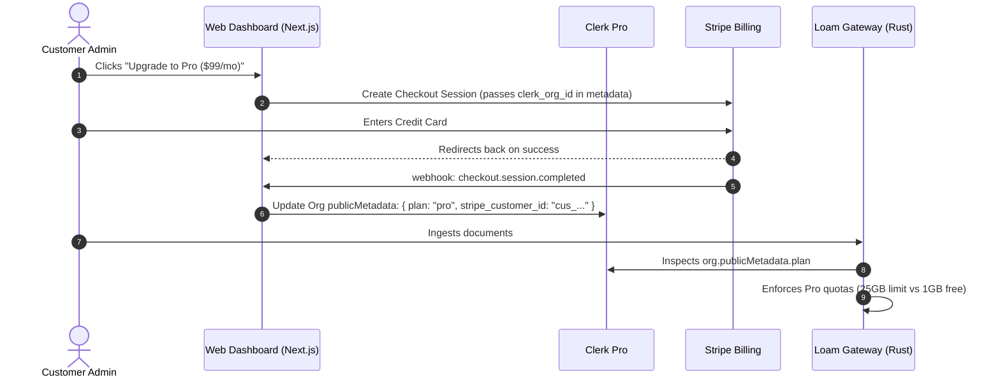

# 07 — Clerk Pro, Stripe Billing & Enterprise Compliance Guide

**Status:** Implementation Blueprint  
**Stack:** Clerk Pro + Stripe Billing + Rust Axum  
**Covers:** Multi-Tenancy, Enterprise SSO, Audit Logs, GDPR, HIPAA, SOC 2  

---

## 1. System Architecture: Clerk Pro Integration



---

## 2. Authentication & Tenant Mapping

### 2.1 Organizations Map 1:1 to Namespaces
Clerk provides first-class B2B multi-tenancy through **Organizations**. In Operon, every collection belongs to a [`NamespaceId`](file:///home/dinakaran/Documents/Operon/crates/operon-common/src/ids.rs):

$$\mathbf{Clerk\ Organization\ ID}\ (\text{e.g. } \texttt{org\_2aB3...}) \;\Longleftrightarrow\; \mathbf{Operon\ NamespaceId}$$

When a user switches organizations in the web console, their session JWT contains:
```json
{
  "sub": "user_2aX9...",
  "org_id": "org_2aB3...",
  "org_role": "org:admin",
  "org_slug": "acme-corp"
}
```

### 2.2 Verifying Clerk JWTs in Rust Axum (`axum-jwks`)
The Rust gateway fetches Clerk's public JWKS once at boot and verifies JWT signatures **networklessly with sub-microsecond latency**:

```rust
use axum::{Router, routing::get, extract::State, response::IntoResponse, Json};
use axum_jwks::{Jwks, Claims};
use serde::{Deserialize, Serialize};

#[derive(Debug, Serialize, Deserialize)]
pub struct ClerkClaims {
    pub sub: String,              // Clerk User ID
    pub org_id: Option<String>,    // Clerk Organization ID (Operon Namespace)
    pub org_role: Option<String>,  // "org:admin" or "org:member"
}

pub async fn build_router() -> Router {
    let jwks = Jwks::from_oidc_url("https://clerk.your-domain.com/.well-known/openid-configuration")
        .await
        .expect("Failed to initialize Clerk JWKS");

    Router::new()
        .route("/v1/collections", get(list_collections))
        .with_state(jwks)
}

async fn list_collections(Claims(claims): Claims<ClerkClaims>) -> impl IntoResponse {
    let org_id = claims.org_id.unwrap_or(claims.sub);
    Json(format!("Authorized for namespace: {}", org_id))
}
```

### 2.3 Machine-to-Machine API Keys
For Python and LangChain SDKs:
1. In the dashboard, developers generate a key: `loam_sk_live_` + 32 random bytes.
2. Store the SHA-256 hash in your control plane database:
   `key_hash | org_id | name | created_at | scopes`
3. When requests arrive with `Authorization: Bearer loam_sk_live_...`, hash the token and resolve the customer's `org_id` (Operon namespace).

---

## 3. Billing Integration: Clerk + Stripe



1. **Self-Service Billing Portal:** Embed Stripe's Customer Portal in your Next.js dashboard for credit card updates, tax invoices, and plan management.
2. **Metered Overage Billing:** Run a nightly background task in Operon that counts storage bytes on S3 and calls Stripe Metered Usage API (`stripe.subscriptionItems.createUsageRecord`).

---

## 4. Enterprise Compliance Features

### 4.1 Enterprise SSO (SAML 2.0 & OIDC via Okta)
1. In Clerk Dashboard $\to$ **Enterprise Connections**, enable **SAML / OIDC**.
2. Organization admins enter their corporate domain (e.g., `acme.com`) and provide the SAML ACS URL and Entity ID generated by Clerk.
3. **Domain Enforcement:** Anyone with an `@acme.com` email address is automatically forced to log in via Okta.
4. **Just-In-Time (JIT) Provisioning:** When a new engineer logs in through Okta, Clerk automatically creates their user record and adds them to the Acme organization.

### 4.2 Compliance-Grade Audit Logs
* **Authentication Logs (Handled by Clerk):** Clerk natively logs login timestamps, IP addresses, MFA prompts, and SSO handshakes, streaming them via webhooks to Datadog or AWS CloudWatch.
* **Control Plane Logs (Rust Gateway):** Log all administrative actions (`api_key.created`, `collection.dropped`) to an append-only S3 bucket.
* **Data Plane Logs (The BYOC Advantage):** In the BYOC model, queries run inside the customer’s AWS VPC. The customer turns on **AWS CloudTrail / VPC Flow Logs**, owning their own query audit trail.

### 4.3 GDPR (General Data Protection Regulation)
1. **Data Residency:** Customers select their S3 storage region (e.g., `eu-central-1` Frankfurt). All Lance/Tantivy files stay within Europe.
2. **Right to be Forgotten (Article 17):** When a user requests account deletion, Clerk fires the `user.deleted` webhook. The control plane cascades a hard delete of their personal namespaces and S3 prefixes (`DELETE /ns/<user_namespace>/...`).
3. **Data Processing Agreement (DPA):** Execute a standard DPA with Clerk and AWS to provide signed DPAs to European customers.

### 4.4 HIPAA (Healthcare)
* **The BYOC Advantage:** Under HIPAA, storing Protected Health Information (PHI) requires rigorous audits and legal liability. In the BYOC model, **data never touches your servers**; all medical embeddings and records reside in the hospital's own AWS S3 bucket and private VPC.
* **Encryption Standards:** TLS 1.3 in transit; AES-256 via AWS KMS with Customer Managed Keys (CMK) at rest.

### 4.5 SOC 2 Type II
1. Connect an automated compliance platform (**Vanta**, **Drata**, or **Secureframe**) to your AWS account and GitHub repository.
2. **Clerk Satisfies Identity Controls:** Enforce MFA for all team members and role-based access control (`admin` vs `member`).
3. Hand Clerk’s existing SOC 2 Type II certification report to your auditors to cover the entire authentication surface.
