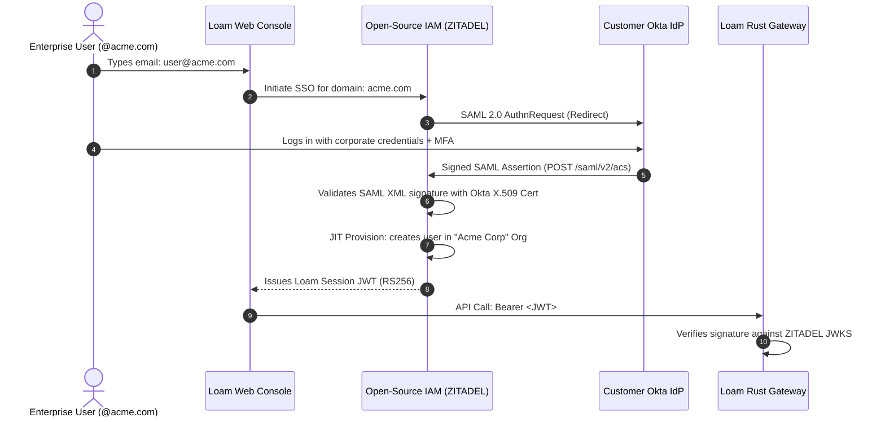
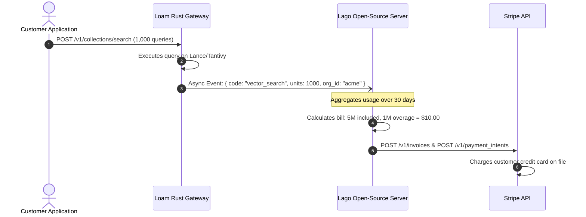

# 08 — Open-Source Enterprise Identity, Okta SSO, Lago Billing & Compliance

**Status:** Open-Source Implementation Blueprint  
**Stack:** ZITADEL / Keycloak + Okta + Lago + Stripe + Rust Axum  
**Covers:** 100% Open-Source Auth, Metered Billing, Audit Logs, GDPR, HIPAA, SOC 2  

---

## 1. The 100% Open-Source Enterprise Stack

```mermaid
flowchart TD
    subgraph Client ["Client & Consumer Layer"]
        Browser["Next.js Web Console"]
        SDK["Python / LangChain SDK (API Keys)"]
    end

    subgraph AuthLayer ["Open-Source Identity & Enterprise SSO"]
        Zitadel["ZITADEL / Keycloak (Open Source IAM)\n• Multi-tenant Organizations\n• SAML 2.0 / OIDC Identity Broker\n• Native Audit Event Logs\n• Issues OIDC RS256 JWTs"]
        Okta["Customer Enterprise Okta IdP\n(SAML 2.0 / OIDC Integration)"]
    end

    subgraph BillingLayer ["Open-Source Metering & Stripe Rail"]
        Lago["LAGO (Open Source Metering & Billing)\n• Ingests usage events (bytes scanned, queries)\n• Manages plans, quotas, and overages\n• Calculates monthly invoices"]
        Stripe["Stripe Payments (Payment Rail)\n• Card Processing & Invoicing Webhooks"]
    end

    subgraph EngineLayer ["Loam Cloud Gateway (Rust Axum)"]
        Axum["Axum Gateway (axum-jwks)\nValidates JWT from Zitadel / Keycloak"]
        AuditLog["Audit Logger (OpenTelemetry)\nStreams structured events to S3"]
        Operon["Operon Engine\n(Lance + Tantivy on S3)"]
    end

    Browser -->|OIDC Auth Flow| Zitadel
    Okta <-->|SAML 2.0 Protocol| Zitadel
    Browser -->|JWT Session| Axum
    SDK -->|API Key (loam_sk_...)| Axum
    Axum --> Operon
    Operon -.->|Emit Usage Event| Lago
    Lago -->|Sync Invoices & Charge| Stripe
    Axum -.->|Audit Trails| AuditLog
```

---

## 2. Identity & Enterprise SSO with Okta (ZITADEL)

Instead of proprietary Clerk, use **[ZITADEL](https://zitadel.com/)** (modern, Go-based, cloud-native IAM) or **[Keycloak](https://www.keycloak.org/)** (Red Hat's battle-tested standard). ZITADEL is built natively around **Organizations (Multi-Tenancy)** and **SAML/OIDC Identity Brokering**.

### How Customer Okta Connects to Your Open-Source Stack:



### Step-by-Step Setup:
1. **Deploy ZITADEL via Docker / Kubernetes:** Runs on top of a standard PostgreSQL database.
2. **Create an Enterprise Identity Provider in ZITADEL:**
   * Select **SAML 2.0 Identity Provider**.
   * Give the customer your **ACS URL** (`https://auth.loam.dev/saml/v2/acs`) and **Audience URI** (`https://auth.loam.dev/saml/v2/metadata`).
   * The customer provides their **Okta Single Sign-On URL** and **Okta X.509 Public Certificate**.
3. **Domain Routing:** Configure ZITADEL to automatically redirect anyone with an `@acme.com` email address to Acme's Okta login portal.
4. **Rust Axum Verification:** Your Rust server validates ZITADEL's OIDC tokens using standard JWKS verification (`axum-jwks` or `jsonwebtoken`), identical to Clerk.

---

## 3. Usage Metering & Billing: Lago + Stripe

To run usage-based billing without building complex metering logic from scratch, use **[Lago](https://www.getlago.com/)** (the leading open-source metering and billing platform).

### How Lago and Stripe Work Together:
* **Lago is the Billing Brain:** Tracks real-time usage (queries, GB stored), applies pricing tiers, calculates overages, and generates invoices.
* **Stripe is the Payment Rail:** Lago talks to the Stripe API to charge the customer's credit card and send receipts.



### Implementing Metering in Rust:
Every time an endpoint finishes, emit a lightweight async event to Lago:
```rust
pub async fn record_query_usage(org_id: &str, query_count: u32) {
    let payload = serde_json::json!({
        "event": {
            "transaction_id": uuid::Uuid::new_v4().to_string(),
            "customer_id": org_id,
            "code": "vector_query",
            "properties": { "count": query_count },
            "timestamp": std::time::SystemTime::now()
                .duration_since(std::time::UNIX_EPOCH).unwrap().as_secs()
        }
    });

    let _ = reqwest::Client::new()
        .post("http://lago-api:3000/api/v1/events")
        .header("Authorization", "Bearer YOUR_LAGO_API_KEY")
        .json(&payload)
        .send()
        .await;
}
```

---

## 4. Compliance-Grade Open-Source Audit Logging

### 4.1 Structured Audit Log Schema (OpenTelemetry)
Emit all administrative and authentication events using standard structured JSON:

```json
{
  "timestamp": "2026-09-26T01:15:30.123Z",
  "audit_version": "1.0",
  "event_id": "aud_01J8G5...",
  "actor": {
    "user_id": "usr_9981",
    "email": "engineer@acme.com",
    "auth_method": "okta_saml_sso",
    "ip_address": "198.51.100.42",
    "user_agent": "Mozilla/5.0..."
  },
  "action": "collection.drop",
  "resource": {
    "type": "collection",
    "id": "col_7712",
    "name": "production_embeddings",
    "namespace": "org_acme_corp"
  },
  "status": "success",
  "prev_hash": "e3b0c44298fc1c149afbf4c8996fb92427ae41e4649b934ca495991b7852b855"
}
```

### 4.2 Storage & Tamper-Proofing (S3 Object Lock)
* **Log Shipper:** Use **[Vector](https://vector.dev/)** (open-source Rust log pipeline by Datadog) to collect audit logs from gateway pods.
* **Storage:** Stream logs into an S3 bucket configured with **S3 Object Lock in Compliance Mode** (WORM: Write Once, Read Many). Logs cannot be deleted or modified for 365 days, fulfilling SOC 2 and HIPAA audit retention controls.

---

## 5. GDPR, HIPAA, and SOC 2 Playbook (Open-Source Edition)

| Standard | Open-Source Tool / Pattern | How It Fulfills Control |
|---|---|---|
| **SOC 2 Type II** | **ZITADEL / Keycloak** | Mandatory MFA + RBAC |
| | **Vector + S3 WORM Lock** | Immutable audit trails |
| | **OpenSCAP / Trivy** | Automated vulnerability & config scanning |
| **HIPAA** | **BYOC Model** | Zero PHI on your servers |
| | **AWS KMS + TLS 1.3** | End-to-end encryption |
| | **AWS BAA Agreement** | Infrastructure covered |
| **GDPR** | **Regional S3 Buckets** | Data sovereignty (EU) |
| | **Erasure Worker** | Right to be forgotten |
| | **PostgreSQL Encrypted** | Anonymized metadata |

### Automated Compliance Testing Tools:
1. **[Trivy](https://github.com/aquasecurity/trivy):** Open-source container and filesystem vulnerability scanner. Run in GitHub Actions CI to ensure zero critical CVEs in Docker images.
2. **[ScoutSuite](https://github.com/nccgroup/ScoutSuite):** Open-source multi-cloud security auditing tool checking AWS against CIS benchmarks (S3 public access blocks, KMS encryption, IAM least privilege).
3. **[Open Policy Agent (OPA)](https://www.openpolicyagent.org/):** Enforce policy-as-code: ensure no S3 bucket can be created without SSE-KMS encryption and no EC2 security group allows port 22 ingress.

---

## 6. Comparison: Clerk Pro vs. Open-Source Stack

| Dimension | Clerk Pro + Stripe | Open-Source (ZITADEL + Lago + Stripe) |
|---|---|---|
| **Setup Speed** | **Instant (2–3 days)** | 1–2 weeks (requires Docker/K8s deployment) |
| **Ongoing Tooling Cost** | ~$25–$100+/mo (scales with MAU) | **$0.00 in software licenses** (only AWS VM costs) |
| **Data Ownership** | Clerk holds user accounts & credentials | **You own the entire database & identity state** |
| **Air-Gapped / On-Prem** | ❌ Impossible (Cloud-only) | **✅ 100% self-hostable anywhere (GovCloud, on-prem)** |
| **Okta SAML Integration** | Requires Clerk Enterprise add-on | **✅ Built-in for free in ZITADEL / Keycloak** |
| **Usage Metering** | Basic Stripe checkout | **✅ Advanced multi-attribute metering via Lago** |
