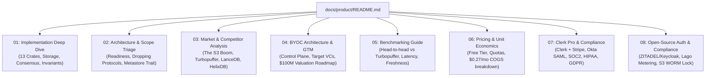
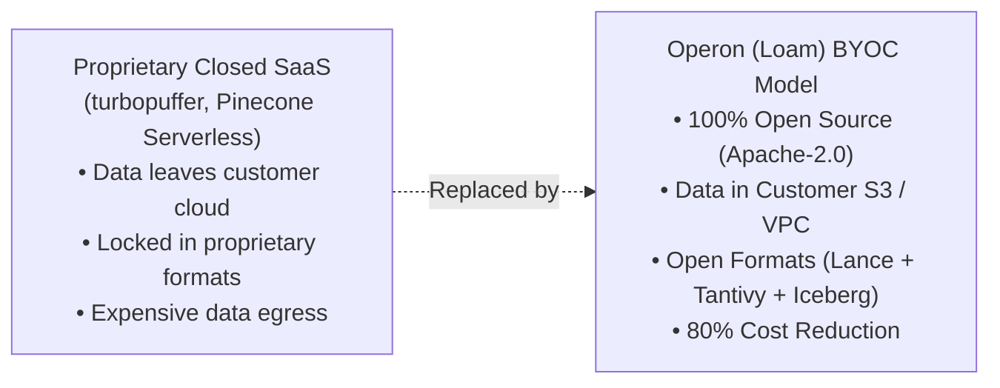

# Operon (Loam) — Product & Strategy Documentation

Welcome to the strategic, architectural, and commercial documentation for **Operon** (working title: **Loam**). This directory consolidates the complete architectural review, technical implementation deep-dive, competitive market analysis, pricing unit economics, and enterprise compliance playbooks.

---

## Document Index

| Document | Title & Focus | Description |
|---|---|---|
| **[01 — Current Implementation Deep Dive](file:///home/dinakaran/Documents/Operon/docs/product/01-current-implementation-deep-dive.md)** | Technical Architecture & Primitives | In-depth breakdown of all 13 crates, the dual Lance + Tantivy storage model, OpenRaft consensus, leaderless S3 WAL, and step-by-step write/read/materialize data flows. |
| **[02 — Architecture Review & Scope Strategy](file:///home/dinakaran/Documents/Operon/docs/product/02-architecture-review-and-scope.md)** | Production Readiness & Protocol Triage | Why Operon is not yet ready for production, why dropping Kafka/Neo4j/ClickHouse avoids the "five-product trap", and how to make the metastore pluggable behind a high-level trait (the Lakekeeper model). |
| **[03 — Market Landscape & Competitors](file:///home/dinakaran/Documents/Operon/docs/product/03-market-landscape-and-competitors.md)** | The "Open-Source Turbopuffer" Thesis | Analysis of the S3-native infrastructure shift, why Anthropic uses turbopuffer, why turbopuffer being closed-source is a multi-billion dollar opportunity, and competitive positioning against LanceDB, Milvus, and HelixDB. |
| **[04 — BYOC Architecture & Commercial GTM](file:///home/dinakaran/Documents/Operon/docs/product/04-byoc-architecture-and-gtm.md)** | Bring Your Own Cloud & VC Roadmap | The BYOC data plane vs. control plane architecture, Developer-Led Growth (DLG) playbook, target VCs (Theory Ventures, Amplify Partners, Greylock), 24-month valuation models ($8M–$200M), and Seed pitch deck. |
| **[05 — Benchmarking Guide vs. Turbopuffer](file:///home/dinakaran/Documents/Operon/docs/product/05-benchmarking-guide-turbopuffer.md)** | Performance & Verification | Methodology to benchmark head-to-head against turbopuffer using VectorDBBench, the 5 critical test scenarios, latency analysis (p50/p99), and where Operon achieves superior end-to-end performance. |
| **[06 — Pricing Tiers & Unit Economics](file:///home/dinakaran/Documents/Operon/docs/product/06-pricing-and-unit-economics.md)** | Developer Free Tier & COGS | Design of the 1 GB free developer tier, anti-abuse safeguards, and unit economics showing why an active free user costs only ~$0.27/month ($0.02 idle) on S3. |
| **[07 — Clerk Pro, Billing & Compliance](file:///home/dinakaran/Documents/Operon/docs/product/07-auth-billing-and-compliance.md)** | SaaS Auth, Billing & Enterprise Security | Fast-track blueprint using Clerk Pro and Stripe Billing for multi-tenant organizations, Okta SAML SSO, audit logging, GDPR right-to-erase, HIPAA BAA, and SOC 2 Type II. |
| **[08 — Open-Source Identity & Compliance](file:///home/dinakaran/Documents/Operon/docs/product/08-opensource-auth-billing-and-compliance.md)** | 100% Open-Source Stack | Complete self-hostable implementation using ZITADEL/Keycloak (Okta SSO brokering), Lago (metered usage billing with Stripe), Vector + S3 WORM audit locks, and Trivy/ScoutSuite. |

---

## Executive Summary: The Core Thesis

> **Operon (Loam) is the open-source, S3-native hybrid retrieval engine for AI.**
> It delivers sub-20ms vector similarity and BM25 full-text search directly on customer-owned object storage (S3/GCS/Azure) using open formats (Lance, Tantivy, Apache Iceberg) with zero idle compute cost.

1. **The Market Opportunity:** Anthropic validated the multi-namespace S3 search architecture by using turbopuffer. Because turbopuffer is closed-source and proprietary, regulated enterprise companies (banks, healthcare, defense, enterprise SaaS) cannot legally use it. Operon fills this void as the open-source standard.
2. **The Architectural Advantage:** By combining **Lance** (vector columnar files) and **Tantivy** (Lucene-compatible BM25) under a unified atomic manifest, compute nodes cache hot NVMe blocks via RisingWave's **`foyer`**, delivering wire-speed performance at S3 economics.
3. **The Commercial Playbook:** Ship Milestone M1 (hybrid search), launch openly to the developer ecosystem, and commercialize via a **Bring Your Own Cloud (BYOC)** SaaS model targeting top-tier data infrastructure investors.
